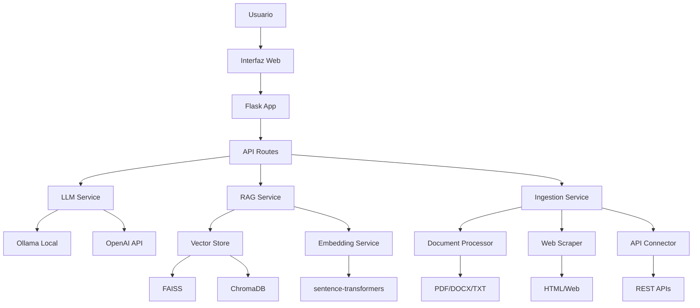

# 🤖 Prototipo_chatbot

**Sistema de Chatbot RAG para Administraciones Locales**  
*Trabajo Final de Máster - Vicente Caruncho Ramos*  
*Tutor: Rafael Berlanga Llavori*


## 📋 Descripción

Sistema conversacional basado en arquitectura RAG (Retrieval-Augmented Generation) diseñado específicamente para administraciones locales españolas. Permite a técnicos municipales consultar información sobre procedimientos administrativos, normativas y servicios públicos mediante lenguaje natural.

### ✨ Características Principales

- **🔍 RAG Avanzado**: Recuperación semántica desde múltiples fuentes (documentos, APIs, web, BBDD)
- **⚖️ Comparación de Modelos**: Evaluación directa entre modelos locales (Ollama) y comerciales (OpenAI)
- **🛡️ Seguridad Local**: Cumplimiento ENS y CCN-TEC 014, procesamiento local de datos sensibles
- **🔧 Arquitectura Modular**: Componentes intercambiables y configuración flexible
- **📊 Métricas Detalladas**: Monitoreo de rendimiento, tokens y tiempos de respuesta
- **📥 Ingesta Multimodal**: Procesamiento de PDF, DOCX, Excel, CSV y contenido web

## 🏗️ Arquitectura del Sistema



## 🚀 Inicio Rápido

### Prerrequisitos

- **Python 3.9+**
- **Git**
- **Ollama** (para modelos locales) - [Instalar Ollama](https://ollama.ai/)
- **OpenAI API Key** (opcional, para modelos OpenAI)

### 1. Clonar y Configurar

```bash
# Clonar repositorio
git clone https://github.com/tuusuario/prototipo_chatbot.git
cd prototipo_chatbot

# Crear entorno virtual
python -m venv venv

# Activar entorno virtual
# Windows:
venv\Scripts\activate
# Linux/Mac:
source venv/bin/activate

# Instalar dependencias
pip install --upgrade pip
pip install -r requirements.txt
```

### 2. Configurar Variables de Entorno

```bash
# Copiar archivo de ejemplo
cp .env.example .env

# Editar .env con tus configuraciones
# Especialmente OPENAI_API_KEY si planeas usar OpenAI
```

### 3. Configurar Ollama (Modelos Locales)

```bash
# Instalar modelos recomendados
ollama pull llama3.2:3b
ollama pull mistral:7b
ollama pull gemma2:2b

# Verificar modelos instalados
ollama list
```

### 4. Ejecutar la Aplicación

```bash
# Ejecutar script de setup (primera vez)
python scripts/setup_project.py

# Iniciar aplicación
python run.py
```

### 5. Acceder a la Aplicación

Abre tu navegador y ve a: **http://localhost:5000**

## 📁 Estructura del Proyecto

```
Prototipo_chatbot/
├── app/                          # Aplicación principal
│   ├── core/                     # Configuración y logging
│   │   ├── config.py            # Gestión de configuración
│   │   └── logger.py            # Sistema de logging
│   ├── models/                   # Modelos de datos
│   │   └── __init__.py          # Entidades y validaciones
│   ├── services/                 # Servicios de negocio
│   │   ├── rag/                 # Sistema RAG
│   │   ├── ingestion/           # Ingesta de datos
│   │   └── llm_service.py       # Servicio de LLMs
│   ├── routes/                   # Rutas web
│   │   ├── api.py               # API REST
│   │   ├── chat.py              # Chat web
│   │   └── main.py              # Rutas principales
│   ├── templates/                # Templates HTML
│   │   ├── base.html            # Template base
│   │   ├── index.html           # Página principal
│   │   ├── chat/                # Templates de chat
│   │   └── errors/              # Páginas de error
│   ├── static/                   # Archivos estáticos
│   │   ├── css/                 # Estilos CSS
│   │   └── js/                  # JavaScript
│   └── __init__.py              # Factory de aplicación
├── config/                       # Configuraciones
│   └── settings.yaml            # Configuración principal
├── data/                         # Datos del sistema
│   ├── documents/               # Documentos para ingesta
│   ├── vectorstore/             # Almacenes vectoriales
│   └── temp/                    # Archivos temporales
├── scripts/                      # Scripts de utilidad
│   └── setup_project.py         # Script de configuración
├── tests/                        # Tests automatizados
├── logs/                         # Archivos de log
├── requirements.txt              # Dependencias Python
├── run.py                        # Punto de entrada
├── .env.example                  # Variables de entorno ejemplo
└── README.md                     # Esta documentación
```

## 🔧 Configuración

### Configuración Principal

El archivo `config/settings.yaml` contiene toda la configuración del sistema:

```yaml
# Configuración de modelos
models:
  local:
    default: "llama3.2:3b"
    endpoint: "http://localhost:11434"
  openai:
    default: "gpt-4o-mini"

# Configuración RAG
rag:
  enabled: true
  k_default: 5
  chunk_size: 500
  similarity_threshold: 0.7

# Vector stores
vector_stores:
  default: "faiss"
  faiss:
    path: "data/vectorstore/faiss"
```

### Variables de Entorno (.env)

```env
# Desarrollo
FLASK_ENV=development
FLASK_DEBUG=True

# OpenAI (opcional)
OPENAI_API_KEY=sk-tu-api-key-aqui

# Modelos por defecto
DEFAULT_LOCAL_MODEL=llama3.2:3b
DEFAULT_OPENAI_MODEL=gpt-4o-mini

# Configuración RAG
RAG_K_DEFAULT=5
CHUNK_SIZE=500
```

## 💬 Uso del Sistema

### Interfaz de Chat

1. **Acceder al Chat**: Ir a `/chat` o hacer clic en "Chat RAG"
2. **Configurar Modelo**: Seleccionar proveedor (Ollama/OpenAI) y modelo específico
3. **Habilitar RAG**: Activar recuperación de documentos para contexto
4. **Hacer Consultas**: Escribir preguntas sobre administración local

### Ejemplos de Consultas

```
¿Qué documentos necesito para una licencia de obra?
¿Cómo tramito una subvención municipal?
¿Qué ordenanzas regulan el ruido en espacios públicos?
¿Cuáles son los plazos para presentar alegaciones?
```

### Modo Comparación

Activa el modo comparación para evaluar respuestas de múltiples modelos:

1. Hacer clic en el botón de comparación ⚖️
2. La misma consulta se enviará a todos los proveedores disponibles
3. Ver respuestas lado a lado con métricas de rendimiento

## 📊 Dashboard y Métricas

### Dashboard Principal

Accede a `/dashboard` para ver:

- **Métricas de Uso**: Consultas totales, tiempo de respuesta promedio
- **Estado de Servicios**: RAG, LLM, ingesta
- **Gráficos de Rendimiento**: Uso temporal, distribución de modelos
- **Actividad Reciente**: Log de acciones del sistema

### API de Métricas

```bash
# Estado del sistema
GET /api/status

# Estadísticas completas
GET /api/stats

# Modelos disponibles
GET /api/models
```

## 📥 Ingesta de Datos

### Formatos Soportados

- **Documentos**: PDF, DOCX, TXT, RTF, MD
- **Hojas de Cálculo**: XLSX, XLS, CSV
- **Web**: HTML, scraping de URLs
- **APIs**: Endpoints REST

### Agregar Documentos

1. **Vía Interfaz Web**: Usar la función de carga (en desarrollo)
2. **Vía API**:

```bash
# Procesar documentos
POST /api/ingestion/documents
{
  "file_paths": ["ruta/documento.pdf"]
}

# Procesar URLs
POST /api/ingestion/urls
{
  "urls": ["https://ejemplo.com/pagina.html"]
}
```

3. **Vía Código**:

```python
from app.services.ingestion import process_documents

# Procesar archivos
chunks = process_documents([
    "data/documents/procedimientos.pdf",
    "data/documents/normativas.docx"
])

# Añadir al sistema RAG
from app.services.rag import add_documents_to_rag
add_documents_to_rag(chunks)
```

## 🔍 API REST

### Endpoints Principales

#### Chat y Consultas

```bash
# Enviar consulta individual
POST /api/chat/query
{
  "query": "¿Cómo tramito una licencia?",
  "provider": "ollama",
  "use_rag": true,
  "rag_k": 5
}

# Comparar respuestas de modelos
POST /api/chat/compare
{
  "query": "¿Qué es una declaración responsable?",
  "use_rag": true
}
```

#### Búsqueda RAG

```bash
# Búsqueda semántica
POST /api/rag/search
{
  "query": "licencia de apertura",
  "k": 10,
  "threshold": 0.7
}
```

#### Sistema

```bash
# Estado del sistema
GET /api/status

# Estadísticas completas
GET /api/stats

# Configuración de modelos
GET /api/config/models
```

### Ejemplo de Respuesta

```json
{
  "success": true,
  "content": "Para tramitar una licencia de obra necesitas...",
  "model": {
    "name": "llama3.2:3b",
    "type": "local",
    "response_time": 2.34,
    "tokens_used": 156
  },
  "rag": {
    "enabled": true,
    "sources": [
      {
        "source_path": "procedimientos.pdf",
        "content": "Las licencias de obra se tramitan...",
        "section_title": "Capítulo 3: Licencias"
      }
    ]
  }
}
```

## 🛡️ Seguridad y Cumplimiento

### Cumplimiento Normativo

- **ENS** (Esquema Nacional de Seguridad): Configuración de logs y trazabilidad
- **CCN-TEC 014**: Recomendaciones para sistemas con IA
- **RGPD**: Protección de datos personales

### Características de Seguridad

- **Modelos Locales**: Datos sensibles no salen del servidor
- **Rate Limiting**: Protección contra abuso de API
- **Sanitización**: Validación de entrada de usuarios
- **Logging**: Registro completo de actividad
- **Headers de Seguridad**: Protección contra XSS, clickjacking

### Configuración de Seguridad

```yaml
security:
  rate_limit_per_minute: 60
  max_query_length: 1000
  sanitize_inputs: true
  log_failed_requests: true
  
  security_headers:
    x_content_type_options: "nosniff"
    x_frame_options: "DENY"
```

## 🔧 Desarrollo

### Configurar Entorno de Desarrollo

```bash
# Instalar dependencias de desarrollo
pip install -r requirements-dev.txt

# Configurar pre-commit hooks
pre-commit install

# Ejecutar tests
pytest tests/

# Linting y formateo
black app/
ruff check app/
```

### Estructura de Tests

```bash
tests/
├── unit/                    # Tests unitarios
│   ├── test_config.py      # Tests de configuración
│   ├── test_models.py      # Tests de modelos
│   └── test_services.py    # Tests de servicios
├── integration/            # Tests de integración
│   ├── test_api.py        # Tests de API
│   └── test_rag.py        # Tests de sistema RAG
└── fixtures/              # Datos de prueba
```

### Contribuir

1. Fork del repositorio
2. Crear rama de feature: `git checkout -b feature/nueva-funcionalidad`
3. Commit cambios: `git commit -m 'Añadir nueva funcionalidad'`
4. Push a la rama: `git push origin feature/nueva-funcionalidad`
5. Crear Pull Request

## 📦 Deployment

### Desarrollo Local

```bash
# Ejecutar en modo desarrollo
python run.py
```

### Docker

```bash
# Construir imagen
docker build -t prototipo_chatbot .

# Ejecutar contenedor
docker run -p 5000:5000 -v $(pwd)/data:/app/data prototipo_chatbot
```

### Cloud Deployment

#### Azure App Service

```bash
# Configurar Azure CLI
az login

# Crear App Service
az webapp create --resource-group myResourceGroup \
                 --plan myAppServicePlan \
                 --name prototipo-chatbot \
                 --runtime "PYTHON|3.9"

# Deploy
az webapp deploy --resource-group myResourceGroup \
                 --name prototipo-chatbot \
                 --src-path .
```

#### AWS Elastic Beanstalk

```bash
# Instalar EB CLI
pip install awsebcli

# Inicializar aplicación
eb init

# Crear entorno y deploy
eb create production
eb deploy
```

#### Google Cloud Run

```bash
# Construir imagen
gcloud builds submit --tag gcr.io/PROJECT_ID/prototipo_chatbot

# Deploy
gcloud run deploy --image gcr.io/PROJECT_ID/prototipo_chatbot \
                  --platform managed \
                  --region europe-west1
```

## 📈 Monitoreo y Métricas

### Métricas Disponibles

- **Rendimiento**: Tiempo de respuesta, throughput
- **Uso**: Consultas por usuario, modelos más usados
- **Calidad**: Tasa de éxito, relevancia RAG
- **Sistema**: CPU, memoria, almacenamiento

### Logs

```bash
# Logs de aplicación
tail -f logs/prototipo_chatbot.log

# Logs de métricas
tail -f logs/metrics.log

# Filtrar por nivel
grep "ERROR" logs/prototipo_chatbot.log
```

### Alertas

Configurar alertas para:
- Tiempo de respuesta > 5 segundos
- Tasa de error > 5%
- Uso de memoria > 85%
- Espacio en disco < 10%

## 🔍 Troubleshooting

### Problemas Comunes

**Error: "Ollama no disponible"**
```bash
# Verificar que Ollama esté ejecutándose
ollama list
curl http://localhost:11434/api/tags

# Reiniciar Ollama si es necesario
ollama serve
```

**Error: "Vector store vacío"**
```bash
# Verificar documentos en directorio
ls data/documents/

# Ejecutar ingesta manual
python -c "
from app.services.ingestion import process_documents
from app.services.rag import add_documents_to_rag
chunks = process_documents(['data/documents/'])
add_documents_to_rag(chunks)
"
```

**Error de memoria con embeddings**
```bash
# Reducir batch_size en config/settings.yaml
models:
  embedding:
    batch_size: 16  # Reducir de 32 a 16
```

### Logs de Debug

```bash
# Activar logging debug
export LOG_LEVEL=DEBUG
python run.py

# Ver logs específicos
grep "rag_service" logs/prototipo_chatbot.log
grep "llm_service" logs/prototipo_chatbot.log
```

## 📚 Documentación Adicional

- **[Guía de Usuario](docs/user_guide.md)**: Uso completo del sistema
- **[Guía de Administrador](docs/admin_guide.md)**: Configuración y mantenimiento
- **[API Reference](docs/api_reference.md)**: Documentación completa de API
- **[Arquitectura](docs/architecture.md)**: Detalles técnicos del sistema
- **[Seguridad](docs/security.md)**: Guías de seguridad y cumplimiento

## 🎓 Información del TFM

### Contexto Académico

- **Universidad**: Universitat Jaume I
- **Máster**: Sistemas Inteligentes
- **Especialidad**: Interacción Avanzada y Gestión del Conocimiento
- **Autor**: Vicente Caruncho Ramos
- **Tutor**: Rafael Berlanga Llavori
- **Año**: 2025

### Objetivos del TFM

1. **Diseñar** arquitectura RAG para administraciones locales
2. **Implementar** sistema de comparación de modelos LLM
3. **Evaluar** rendimiento de modelos locales vs. comerciales
4. **Garantizar** cumplimiento de normativas de seguridad
5. **Demostrar** viabilidad técnica y funcional

### Resultados Esperados

- Sistema funcional de chatbot RAG
- Comparativa técnica de modelos LLM
- Métricas de rendimiento y calidad
- Documentación de buenas prácticas
- Propuesta de mejoras futuras

## 🤝 Colaboradores

- **Vicente Caruncho Ramos** - Desarrollo principal
- **Rafael Berlanga Llavori** - Tutor académico

## 📄 Licencia

Este proyecto está bajo la Licencia MIT. Ver el archivo [LICENSE](LICENSE) para detalles.

## 🙏 Agradecimientos

- Universitat Jaume I por el soporte académico
- Comunidad de desarrollo de LLMs y RAG
- Proyectos open source utilizados:
  - [Ollama](https://ollama.ai/) - Modelos locales
  - [sentence-transformers](https://www.sbert.net/) - Embeddings
  - [FAISS](https://faiss.ai/) - Búsqueda vectorial
  - [Flask](https://flask.palletsprojects.com/) - Framework web

---

**Prototipo_chatbot** - TFM 2025 - Vicente Caruncho Ramos

Para más información: [vicente.caruncho@edu.uji.es](mailto:vicente.caruncho@edu.uji.es)